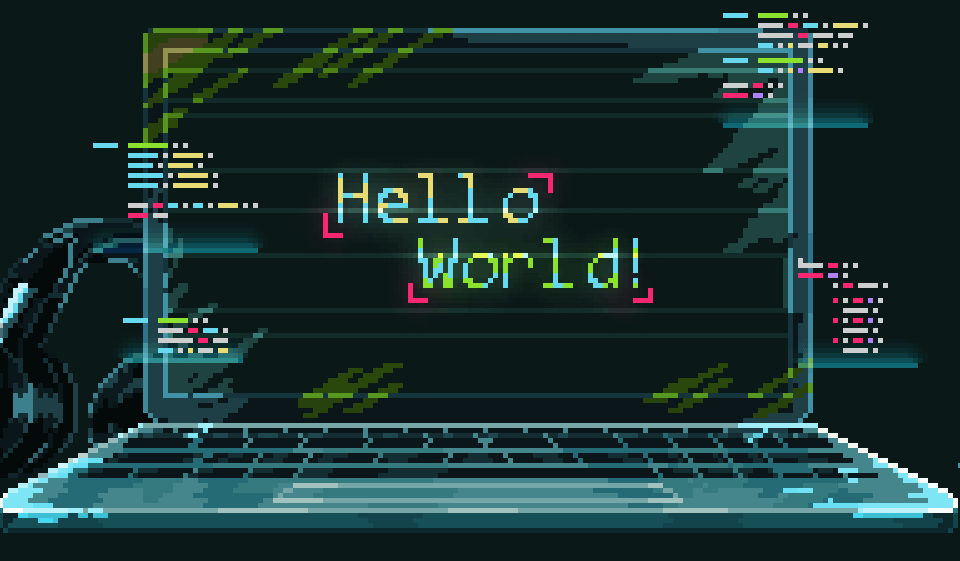

<h1 align="center">👋 Hi there, I'm Gustavo (Takewi)</h1>

<p align="center">
  <strong>Mid-level Frontend Developer</strong> specializing in technical interfaces, real-time telemetry, and in-browser 3D computer graphics.
</p>

<p align="center">
  <a href="https://www.linkedin.com/in/gustavo-viegas-8989a01b4/"></a>
  <a href="https://takewi.com.br/"></a>
  <a href="assets/resume.pdf"></a>
  <a href="mailto:takewi@proton.me"></a>
  <a href="https://github.com/Takewi"></a>
  <a href="https://www.youtube.com/channel/UCQzQ3vyOhPwzxYh4vRpyiWA"></a>
</p>

---



### 🚀 About Me

* 📍 Based in **Pelotas - RS, Brazil** (Available for Remote and Hybrid roles)
* 💼 **Mid-level Frontend Developer** at **Garten Automação**, leading frontend architecture, enterprise cloud platforms, and industrial plant-floor operator interfaces.
* ⚡ Experienced in engineering ultra-lightweight SPAs embedded directly into hardware and microcontrollers (**ESP32**, **Raspberry Pi**, **BeagleBone**) for serverless local operations and industrial edge panels.
* 🎮 Passionate about **3D graphics in the browser (Babylon.js, WebGL)** and game engineering (**Godot Engine**).
* 📄 **Curriculum / Resume:** [View or Download PDF](assets/resume.pdf)
* 💬 Discord: **`gawi_`**

<br clear="right" />

---

### 🛠️ Tech Stack & Ecosystem

```typescript
export const takewi = {
  role: "Mid-level Frontend Developer",
  focus: [
    "Technical Interfaces",
    "Real-Time Telemetry",
    "In-Browser 3D Graphics",
    "Embedded SPAs & Industrial Edge"
  ],
  core: ["TypeScript", "JavaScript (ES6+)", "HTML5", "CSS3 / Sass"],
  frameworks: ["Vue 3 (Composition API)", "Nuxt 3", "React", "Next.js", "Quasar", "Svelte"],
  graphicsAnd3D: ["Babylon.js", "WebGL", "Chart.js", "Godot Engine"],
  embeddedAndIoT: ["ESP32", "Raspberry Pi", "BeagleBone Black"],
  uiAndState: ["Pinia", "Tailwind CSS", "DaisyUI", "Vuetify"],
  backendAndAPIs: ["Node.js", "Express", "RESTful APIs", "GraphQL", "Swagger / OpenAPI"],
  toolsAndDevOps: ["Vite", "Docker", "Git / GitHub", "CI/CD", "Cloudflare", "Linux"]
};
```

---

### 🌟 Featured Engineering & Open Source Projects

* 🌾 **[grain-bin-thermometry](https://github.com/Takewi/grain-bin-thermometry)** (Vue.js + Babylon.js)
  Procedural 3D modeling and rendering of agroindustrial grain bin plants directly in the browser, featuring real-time volumetric thermometry heatmaps and free-camera navigation.

* 🌲 **[causos](https://github.com/Takewi/causos)** (Godot Engine)
  Low-poly horror game architecture with deterministic procedural terrain generation, continuous chunk streaming, and multiplatform CI/CD automation (Linux, Windows, macOS).

---


### 📈 GitHub Stats

<br />

<p align="left">
  
</p>

<p align="left">
  
</p>

<br clear="right" />
